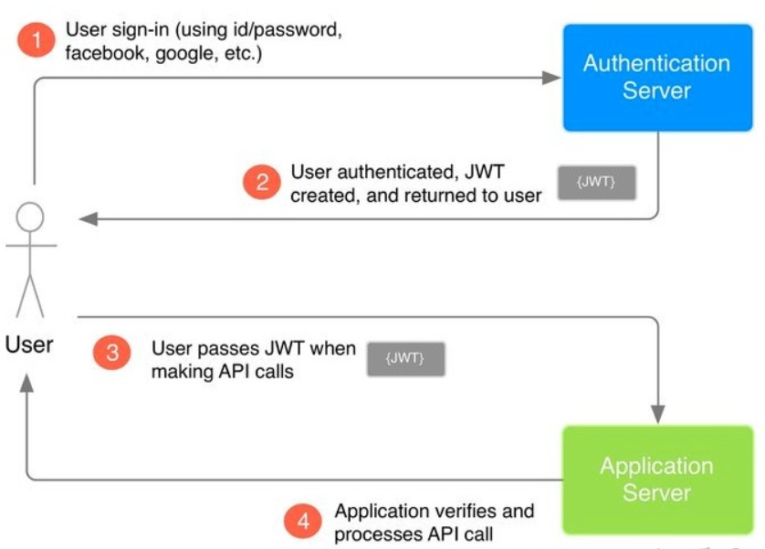

# Login&Register

## Auth module fe-development

### Use Ant-design-vue as UI interface

```
npm install ant-design-vue --save
```

import the library in main.js

```js
import { DatePicker } from 'ant-design-vue';
import 'ant-design-vue/dist/antd.css';
```

### Build auth interface

```
│  │  └─ views
│  │     └─ Auth
│  │        ├─ index.js
│  │        ├─ index.scss
│  │        └─ index.vue
```

Main steps:

1. Build title, tabs, input boxes, buttons
2. Justify the css sheets
3. Add icons in the input box

index.vue:

```vue
<template>
  <div class="auth">
    <div class="bg"></div>
    <div class="title-info">
      
      <h2 class="title">Book Manager System</h2>
    </div>

    <div class="form">
      <a-tabs>
        <a-tab-pane key="1" tab="Log in">
          <div class="item">
            <a-input size="large" placeholder="Account">
              <template #prefix>
                <user-outlined type="user" />
              </template>
            </a-input>
          </div>
          <div class="item">
            <a-input size="large" placeholder="Password">
              <template #prefix>
                <key-outlined />
              </template>
            </a-input>
          </div>
          <div class="item">
            <a href="">Forget Password</a>
          </div>

          <div class="item">
            <a-button type="primary" size="large">Log in</a-button>
          </div>
        </a-tab-pane>
        <a-tab-pane key="2" tab="Register">
          <div class="item">
            <a-input size="large" placeholder="Account">
              <template #prefix>
                <user-outlined type="user" />
              </template>
            </a-input>
          </div>
          <div class="item">
            <a-input size="large" placeholder="Password">
              <template #prefix>
                <key-outlined />
              </template>
            </a-input>
          </div>
          <div class="item">
            <a-input size="large" placeholder="Invite Code">
              <template #prefix>
                <profile-outlined />
              </template>
            </a-input>
          </div>
          <div class="item">
            <a-button type="primary" size="large">Register</a-button>
          </div>
        </a-tab-pane>
      </a-tabs>
    </div>
  </div>
</template>

<script src="./index.js"></script>

<style lang="scss" scoped>
@import './index.scss';
</style>

```

index.scss:

```scss
.bg {
  position: fixed; // fix the bg still
  left: 0;
  top: 0;
  right: 0;
  bottom: 0;
  background-image: url('https://gw.alipayobjects.com/zos/rmsportal/TVYTbAXWheQpRcWDaDMu.svg');
  background-repeat: no-repeat;
  background-size: cover;
  background-position: center center; // put the bg in the center( up-down and left-right)
}

.auth {
  .title-info {
    margin-top: 100px;
    margin-bottom: 32px;
    display: flex; // display the img and title in the same line
    align-items: center; // vertical distribution
    justify-content: center; // horizontal distribution

    img {
      // 60*60 img
      width: 60px;
      height: 60px;
    }

    h2 {
      margin: 0; // other margins
      margin-left: 18px; // left margin
    }
  }

  .form {
    width: 400px;
    margin: 0 auto; // center

    .item {
      margin-bottom: 16px;
      text-align: left; // text go to the left

      button {
        width: 100%; // take all the space
      }
    }
  }
}

```

index.js:

```js
import { defineComponent, reactive } from 'vue' // Code hint; Create responsive data
import { auth } from '@/service'
import { result } from '@/helpers/utils'
import { message } from 'ant-design-vue'

export default defineComponent({
  // hook fn: will only be called when the component is initialized
  setup() {
    // get responsive data from reactive
    const regForm = reactive({
      account: '',
      password: '',
      inviteCode__code: '',
    })
    const loginForm = reactive({
      account: '',
      password: '',
    })

    // register logic
    const register = async () => {
      // pass the data to back-end router
      // get ctx.body from promise
      const res = await auth.register(
        regForm.account,
        regForm.password,
        regForm.inviteCode_code
      )

      result(res).success((data) => {
        message.success(data.msg)
      })
    }

    // login logic
    const login = async () => {
      const res = await auth.login(loginForm.account, loginForm.password)

      result(res).success((data) => {
        message.success(data.msg)
      })
    }

    return {
      regForm,
      loginForm,
      register,
      login,
    }
  },

  // register components
  components: {
  },
})

```

Icons in Ant-design needs to be installed first, and then registered as components in index.js.

Order of using icons:

1. Install dependencies:

```
npm install --save @ant-design/icons-vue
```

2. Import relative icons and register them in index.js:

```js
import { defineComponent } from 'vue'	// Code hint
import {
  UserOutlined,
  KeyOutlined,
  ProfileOutlined,
} from '@ant-design/icons-vue' // icons

export default defineComponent({
  // hook fn: will only be called when the component is initialized
  setup() { ... },

  // register components
  components: {
    UserOutlined,
    KeyOutlined,
    ProfileOutlined,
  },
})
```


## Register be-fe connection

### Routers-be

Install koa/router

```bash
npm i @koa/router
```

Tree structure

```bash
│  └─ src
│     ├─ db
│     │  └─ index.js
│     ├─ index.js		    # use auth router
│     └─ routers
│        ├─ auth
│        │  └─ index.js		# create auth router instance with koa/router
│        └─ index.js	    # register auth router 
```

​	Steps:

1. Create auth instance in routers/auth/index

```js
const Router = require('@koa/router')

// create a Router instance for auth
// use prefix 'auth' to represent that this router deal with auth bussiness
const router = new Router({
  prefix: '/auth',
})

// call the cb fn when /auth/register made a POST request
router.post('/register', async (ctx) => {
  ctx.body = 'successfully registered'
})

module.exports = router
```

2. Register auth router in routers/index

```js
const auth = require('./auth/index')

module.exports = (app) => {
  // register auth as router
  app.use(auth.routes())
}
```

3. Use auth router in index

```js
const Koa = require('koa')
const registerRoutes = require('./routers/index') // require auth router as registerRoutes

const app = new Koa()

//use router
registerRoutes(app)

// app.listen: listen to port 3000 and post a http request, and response after processing
// default URL: localhost
app.listen(3000, () => {
  console.log('launched successfully')
})
```

Visit ` [localhost:3000/auth/register](http://localhost:3000/auth/register)` in the browser:


### Create mongo schemas

```
│  └─ src
│     ├─ db
│     │  ├─ helper.js
│     │  ├─ index.js
│     │  └─ Schemas
│     │     └─ User.js
│     ├─ index.js
│     └─ routers
│        ├─ auth
│        │  └─ index.js
│        └─ index.js
```

Create a schema for user in ./db/Schemas/User.js

```js
const mongoose = require('mongoose')
const { getMeta } = require('../helper')

// create a schema for user
const UserSchema = new mongoose.Schema({
  account: String,
  password: String,

  // get date
  meta: getMeta(),
})

// register UserSchema as model 'User'
mongoose.model('User', UserSchema)
```

The model 'User' will be used in routers.

Require 'User' in the ./db/index.js to register 'User' model. 

Remember to use async for db connect fn to let db to be connected first. Or the request will be ignored before db connection. ./src/index.js

```js
// import mongoose
const mongoose = require('mongoose')
require('./Schemas/User') // excute User.js to register 'User' model

// const UserModal = mongoose.model('User', UserSchema)

// define function for connecting DB
const connect = async () => {
  // only when the db is connected will the port be listened and accept requests
  return new Promise((resolve) => {
    // mongoose methods，local DB port: 27017
    mongoose.connect('mongodb://127.0.0.1:27017')

    // listen for the event "open DB"
    mongoose.connection.on('open', () => {
      console.log('connected successfully')
      resolve()
    })
  })
}

module.exports = {
  connect,
}
```

Install koa-body to deal with requests' body

```
npm i koa-body -S
```

Because require a module = execute this module, therefore connect must be required before routers. ./index.js

```js
const Koa = require('koa')
const koaBody = require('koa-body')
// connect must be required before routers
const { connect } = require('./db/index') // get connect fn to connect mongo
const registerRoutes = require('./routers/index') // require auth router as registerRoutes
const app = new Koa()

// only when the db is connected will the port be listened and accept requests
connect().then(() => {
  registerRoutes(app)
  app.use(koaBody())

  // app.listen: listen to port 3000 and post a http request, and response after processing
  // default URL: localhost
  app.listen(3000, () => {
    console.log('launched successfully')
  })
})
```


### Connect fe-be register logic (fe)

add service for dealing with request in the front-end

```js
 ├─ src
   │  ├─ App.vue
   │  ├─ assets
   │  │  └─ titleIcon.svg
   │  ├─ components
   │  ├─ main.js
   │  ├─ router
   │  │  └─ index.js
   │  ├─ service
   │  │  ├─ auth
   │  │  │  └─ index.js
   │  │  └─ index.js
   │  ├─ store
   │  │  └─ index.js
   │  └─ views
   │     └─ Auth
   │        ├─ index.js
   │        ├─ index.scss
   │        └─ index.vue
   └─ vue.config.js
```

inex.vue:

```vue
<a-tab-pane key="2" tab="Register">
          <div class="item">
            <a-input
              v-model:value="regForm.account"
              size="large"
              placeholder="Account"
            >
              <template #prefix>
                <user-outlined type="user" />
              </template>
            </a-input>
          </div>
          <div class="item">
            <a-input
              v-model:value="regForm.password"
              size="large"
              placeholder="Password"
            >
              <template #prefix>
                <key-outlined />
              </template>
            </a-input>
          </div>
          <div class="item">
            <a-input size="large" placeholder="Invite Code">
              <template #prefix>
                <profile-outlined />
              </template>
            </a-input>
          </div>
          <div class="item">
            <a-button @click="register" type="primary" size="large"
              >Register</a-button
            >
          </div>
        </a-tab-pane>
```

Install axios for front-end

```
npm i axios -S
```

axios is used for posting and intercpting request between fe and be

use axios to post request in ./service/auth/index

```js
import axios from 'axios'

// make a post to back-end
export const register = (account, password) => {
  axios.post('http://localhost:3000/auth/register', {
    account,
    password,
  })
}

export const login = () => {}
```

export register function as a midware in ./service/index

```js
export * as auth from './auth/index'
```

call auth in the Auth front-end component hook

```js
import { defineComponent, reactive } from 'vue' // Code hint; Create responsive data
import {
  UserOutlined,
  KeyOutlined,
  ProfileOutlined,
} from '@ant-design/icons-vue' // icons
import { auth } from '@/service'

export default defineComponent({
  // hook fn: will only be called when the component is initialized
  setup() {
    // get responsive data from reactive
    const regForm = reactive({
      account: '',
      password: '',
    })

    // deal with @click event in .vue
    const register = () => {
      // pass the data to back-end router
      auth.register(regForm.account, regForm.password)
    }

    return {
      regForm,
      register,
    }
  },

  // register components
  components: {
    UserOutlined,
    KeyOutlined,
    ProfileOutlined,
  },
})

```

reactive: A new Vue3 method, it is used for create responsive data. reactive takes obj as parameters, and transform the obj into proxy obj.

proxy obj: used to intercept and modify the target obj to realize the responsive data.


### Connect fe-be register logic (be)

Install koa/cors in the back-end to deal with cross-domain issue.

```
npm i @koa/cors
```

require cors in ./src/index. (and so does koa-body)

```js
const Koa = require('koa')
const koaBody = require('koa-body')
const cors = require('@koa/cors')

// connect must be required before routers
const { connect } = require('./db/index') // get connect fn to connect mongo
const registerRoutes = require('./routers/index') // require auth router as registerRoutes
const app = new Koa()

// only when the db is connected will the port be listened and accept requests
connect().then(() => {
  app.use(cors())
  app.use(koaBody())
  registerRoutes(app)

  // app.listen: listen to port 3000 and post a http request, and response after processing
  // default URL: localhost
  app.listen(3000, () => {
    console.log('launched successfully')
  })
})
```

Receive request in ./routers/auth/index. And check its data.

```js
// call the cb fn when /auth/register made a POST request
router.post('/register', async (ctx) => {
  // get req data from post req
  const { account, password } = ctx.request.body

  // check if this account is already in the 'User' model
  const one = await User.findOne({
    account,
  }).exec()
  // if true
  if (one) {
    ctx.body = {
      code: 0,
      msg: 'Account already existed',
      data: null,
    }
    return
  }

  const user = new User({
    account,
    password,
  })

  // get response data
  const res = await user.save()

  ctx.body = {
    code: 1,
    msg: 'successfully registered',
    data: res,
  }
})
```

The exec() method is used to retrieve matches for regular expression in a string. Here to check if the account in the ctx.request is the same as the one find in the model. 


### Register Logic


## Login be-fe connection

### Connect fe-be login logic (fe)

index.vue:

```vue
        <a-tab-pane key="1" tab="Log in">
          <div class="item">
            <a-input
              v-model:value="loginForm.account"
              size="large"
              placeholder="Account"
            >
              <template #prefix>
                <user-outlined type="user" />
              </template>
            </a-input>
          </div>
          <div class="item">
            <a-input
              v-model:value="loginForm.password"
              size="large"
              placeholder="Password"
            >
              <template #prefix>
                <key-outlined />
              </template>
            </a-input>
          </div>
          <div class="item">
            <a href="">Forget Password</a>
          </div>

          <div class="item">
            <a-button @click="login" type="primary" size="large"
              >Log in</a-button
            >
          </div>
        </a-tab-pane>
```

Add login fn and loginForm in view/Auth/index.js. 

Add new axios.post in service/auth/index.js

The same method as register logic's front-end route.

### Connect fe-be login logic (be)

install JWT (Json web token)

```
npm i jsonwebtoken
```

Add login router in routers/auth/index.js:

```js
router.post('/login', async (ctx) => {
  const { account, password } = getBody(ctx)

  // check if the account exist
  const one = await User.findOne({
    account,
  }).exec()

  // account don't exist
  if (!one) {
    ctx.body = {
      code: 0,
      msg: 'Account or passsword is incorrect!',
      data: null,
    }
    return
  }

  // create a new userRes as respose data to hide the password
  const userRes = {
    account: one.account,
    _id: one._id,
  }

  // check the password
  if (one.password === password) {
    ctx.body = {
      code: 1,
      msg: 'successfully login',
      data: {
        userRes,
        // sign jwt token
        token: jwt.sign(
          // payload have to be a obj
          {
            account: userRes.account,
            _id: userRes._id,
          },
          'book'
        ),
      },
    }
    return
  }

  ctx.body = {
    code: 0,
    msg: 'Account or passsword is incorrect!',
    data: null,
  }
})
```

Require jwt in index.js

```js
const jwt = require('jsonwebtoken')
```

JWT logic:




### Alert message

Write a ./helpers/utils/index.js for message alert.

It returns a obj made of call-back functions. At present, only success() will be called.

```js
import { message } from 'ant-design-vue'

//deal post and return result message
export const result = (res, authShowErr = true) => {
  const { data } = res

  // hint err when get code 0
  if (!data.code && authShowErr) {
    message.error(data.msg)
  }

  // return a obj made of call back fns
  return {
    success(cb) {
      if (data.code) {
        cb(data, res)
      }
      return this
    },
    fail(cb) {
      if (!data.code) {
        cb(data, res)
      }
      return this	// return this to enable the chain coding when calling result function
    },
    finally(cb) {
      cb(data, res)
      return this
    },
  }
}
```

Call result function in the register and login logics

```js
// fn that deal with click events
    const register = async () => {
      // pass the data to back-end router
      // get ctx.body from promise
      const res = await auth.register(regForm.account, regForm.password)

      result(res).success((data) => {
        message.success(data.msg)
      })
    }

    const login = async () => {
      const res = await auth.login(loginForm.account, loginForm.password)

      result(res).success((data) => {
        message.success(data.msg)
      })
    }
```

Add judgement in the back-end.

```js
router.post('/register', async (ctx) => {
  // get req data from post req
  const { account, password } = getBody(ctx)

  // check account and password in the back-end to prevent invalid post
  // that are not send from the front-end
  if (account === '' || password === '') {
    ctx.body = {
      code: 0,
      msg: 'Account and password is empty!',
      data: null,
    }
    return
  } else if (account.length < 3) {
    ctx.body = {
      code: 0,
      msg: 'Account must have more than 3 cahracters!',
      data: null,
    }
    return
  } else if (password.length < 3) {
    ctx.body = {
      code: 0,
      msg: 'Password must have more than 3 cahracters!',
      data: null,
    }
    return
  }
```


## Invite code

### Create invite code schema

./db/Schemas/InviteCode.js

```js
const mongoose = require('mongoose')
const { getMeta } = require('../helper')

// create a schema for user
const InviteCodeSchema = new mongoose.Schema({
  code: String, // Invite code
  user: String, // Used for whom

  // get date
  meta: getMeta(),
})

// register UserSchema as model 'InviteCode'
mongoose.model('InviteCode', InviteCodeSchema)
```

Remember to require model in ./db/index

```js
// import mongoose
const mongoose = require('mongoose')
require('./Schemas/User') // excute User.js to register 'User' model
require('./Schemas/InviteCode')
```


### Connect  fe-be invite-code logic (be)

Install uuid to generating random code

````
npm i uuid
````

uuidv4() will generate a single random key

Add new router in ./routers/invite-code/index

```js
const Router = require('@koa/router')
const mongoose = require('mongoose')
const { getBody } = require('../../helpers/utils')
const jwt = require('jsonwebtoken')
const { v4: uuidv4 } = require('uuid')

const InviteCode = new mongoose.model('InviteCode') // an instance for model 'User'

// create a Router instance for invite
// use prefix 'invite' to represent that this router deal with invite bussiness
const router = new Router({
  prefix: '/invite',
})

router.get('/add', async (ctx) => {
  const code = new InviteCode({
    // generate invite code
    code: uuidv4(),
    user: '',
  })

  // get response data
  const res = await code.save()

  ctx.body = {
    code: 1,
    msg: 'successfully created!',
    data: res,
  }
})

module.exports = router
```

Visit http://localhost:3000/invite/add to send a get request to get a new invite-code


Updata register in auth router

```js
// call the cb fn when /auth/register made a POST request
router.post('/register', async (ctx) => {
  // get req data from post req
  const { account, password, inviteCode } = getBody(ctx)

  console.log(inviteCode)

  // check account and password in the back-end to prevent invalid post
  // that are not send from the front-end
  if (account === '' || password === '') {
    ctx.body = {
      code: 0,
      msg: 'Account and password is empty!',
      data: null,
    }
    return
  } else if (account.length < 3) {
    ctx.body = {
      code: 0,
      msg: 'Account must have more than 3 cahracters!',
      data: null,
    }
    return
  } else if (password.length < 3) {
    ctx.body = {
      code: 0,
      msg: 'Password must have more than 3 cahracters!',
      data: null,
    }
    return
  } else if (inviteCode === '') {
    ctx.body = {
      code: 0,
      msg: 'Invite code is empty!',
      data: null,
    }
    return
  }

  // check if this account is already in the 'User' model
  const findUser = await User.findOne({
    account,
  }).exec()
  // if invalid
  if (findUser) {
    ctx.body = {
      code: 0,
      msg: 'Account already existed',
      data: null,
    }
    return
  }

  // check if invite code is valid
  const findCode = await InviteCode.findOne({
    code: inviteCode,
  }).exec()
  // if invite code is invalid or is already occupied
  if (!findCode || findCode.user) {
    ctx.body = {
      code: 0,
      msg: 'Invite code is invalid!',
      data: null,
    }
    console.log(findCode)
    return
  }

  // create a new user
  const user = new User({
    account,
    password,
  })

  // save the new user to DB & get response data
  const res = await user.save()

  // deliver invite code to this user by id
  findCode.user = res._id
  findCode.meta.updateAt = new Date().getTime() // update timestp

  // save the new invite code to DB
  await findCode.save()

  ctx.body = {
    code: 1,
    msg: 'successfully registered',
    data: res,
  }
})
```

Use new router in ./routers/index

````js
const auth = require('./auth/index')
const inviteCode = require('./invite-code/index')

module.exports = (app) => {
  // register auth as router
  app.use(auth.routes())
  app.use(inviteCode.routes())
}
````


### Connect  fe-be invite-code logic (fe)   

Add new v-model in index.vue

```vue
<a-input
              v-model:value="regForm.inviteCode"
              size="large"
              placeholder="Invite Code"
            >
```

Update register logic in index.js, pass the inviteCode to service

```js
    const regForm = reactive({
      account: '',
      password: '',
      inviteCode__code: '',
    })

	// register logic
    const register = async () => {
      // pass the data to back-end router
      // get ctx.body from promise
      const res = await auth.register(
        regForm.account,
        regForm.password,
        regForm.inviteCode
      )

      result(res).success((data) => {
        message.success(data.msg)
      })
    }
```

Update service

```js
// make a post to back-end
export const register = (account, password, inviteCode) => {
  // return a promise
  return axios.post('http://localhost:3000/auth/register', {
    account,
    password,
    inviteCode,
  })
}
```


Every used invite-code has a relative user.

 
