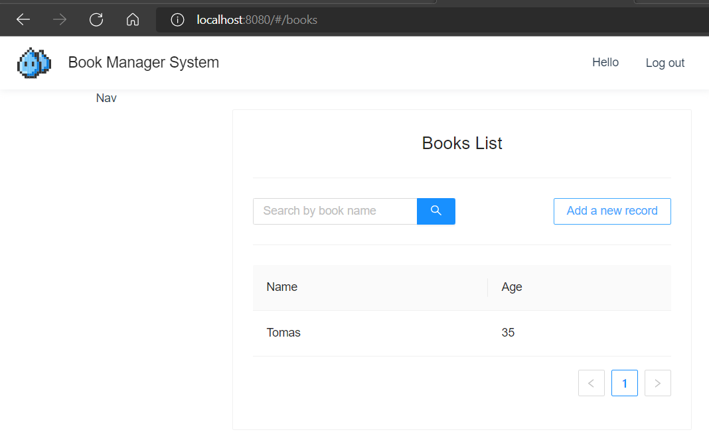
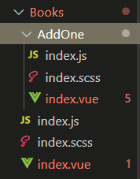
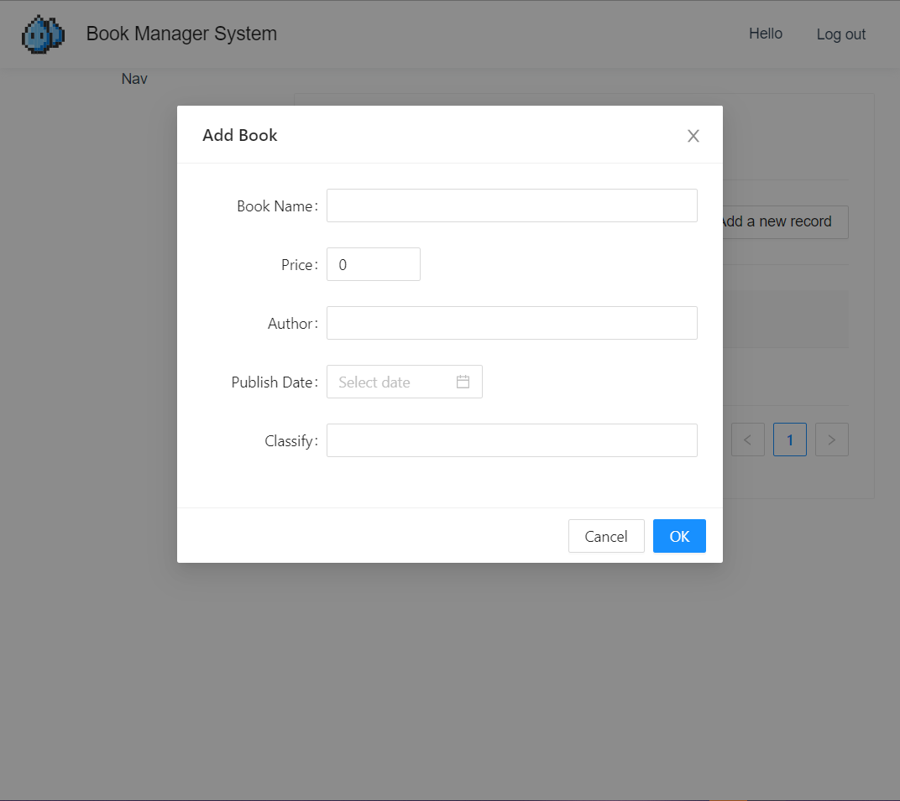

# MainList

## Basic front-end layout

```
│  │  ├─ layout
│  │  │  └─ BasicLayout
│  │  │     ├─ index.js
│  │  │     ├─ index.scss
│  │  │     ├─ index.vue
│  │  │     └─ Nav
│  │  │        ├─ index.js
│  │  │        ├─ index.scss
│  │  │        └─ index.vue

│  │  └─ views
│  │     ├─ Auth
│  │     │  ├─ index.js
│  │     │  ├─ index.scss
│  │     │  └─ index.vue
│  │     └─ Books
│  │        ├─ index.js
│  │        ├─ index.scss
│  │        └─ index.vue
```

### Define BasicLayout component

Create a new component for the main list page called BasicLayout.

```vue
<template>
  <div class="basic-layout">
    <div class="app-header">
      <div class="left">
        
        <div class="title">Book Manager System</div>
      </div>
      <div class="right">
        <div class="hello-msg">Hello</div>
        <div class="logout">Log out</div>
      </div>
    </div>
    <div class="app-header-placeholder"></div>
    <div class="app-content">
      <div class="left">
        <app-nav />
      </div>
      <div class="right">
        <router-view />
      </div>
    </div>
  </div>
</template>

<script src="./index.js"></script>

<style lang="scss" scoped>
@import './index.scss';
</style>

```

Create a children component Nav for BasicLayout for navigation.

Import Nav and register it as a vue-component in .vue. 

AppNav will be tagged as ''app-nav" in .vue.

```vue
export default defineComponent({
  components: {
    AppNav: Nav, // rename it to AppNav to prevent conflict with vue's 'Nav'
  },
})
```

Adjust layouts css.

```scss
.basic-layout {
  // hold the place for nav
  .app-header-placeholder {
    height: 64px;
    width: 100%;
  }
  .app-header {
    height: 64px;
    position: fixed;
    top: 0;
    left: 0;
    background-color: #fff;
    box-shadow: 0 2px 8px #f0f1f2;
    display: flex;
    align-items: center;
    justify-content: space-between;
    padding: 0 16px;
    width: 100%;
    z-index: 1;

    .left {
      display: flex;
      align-items: center;

      img {
        height: 50px;
        margin-right: 16px;
      }

      .title {
        color: rgba(0, 0, 0, 0.87);
        font-size: 18px;
      }
    }

    .right {
      display: flex;
      align-items: center;

      .logout {
        width: 80px;
        text-align: center;
        height: 64px;
        line-height: 64px;
        cursor: pointer;
        margin-left: 16px;

        &:hover {
          background-color: #eee;
        }
      }
    }
  }

  .app-content {
    display: flex;

    .left {
      width: 256px;
      position: fixed;
      background-color: white;
      top: 64px;
      bottom: 0;
    }

    .right {
      flex: 1;
      padding: 24px;
      margin-left: 256px;
    }
  }
}

```

 

### Add children router books

app-content.right should be dynamic, different content will be shown here, so add a router-view in ./BasicLayout/index.js

```vue
      <div class="right">
        <router-view />
      </div>
```

Register it as ./ 's children in ./router.

```js
  {
    path: '/',
    name: 'BasicLayout',
    component: () =>
      import(
        /* webpackChunkName: "BasicLayout" */ '../layout/BasicLayout/index.vue'
      ),
    // children router will be renderen inside its parent
    children: [
      {
        path: '/books',
        name: 'Books',
        component: () =>
          import(/* webpackChunkName: "Book" */ '../views/Books/index.vue'),
      },
    ],
  },
```

localhost:8080/books will be displayed in <router-view> in BasicLayout

Create book page in ./views/Books

```
│  │  └─ views
│  │     ├─ Auth
│  │     │  ├─ index.js
│  │     │  ├─ index.scss
│  │     │  └─ index.vue
│  │     └─ Books
│  │        ├─ index.js
│  │        ├─ index.scss
│  │        └─ index.vue
```

It looks like this:


## Book front-end

In scss, 'scoped' is to state that all scoped css will only be effective within this component. Otherwise the css will be used globally.

### Create a new global component 

Add new self-define component under ./component/Spacebetween

```vue
<template>
  <div class="space-between">
    <slot />
  </div>
</template>

<style lang="scss" scoped>
.space-between {
  display: flex;
  justify-content: space-between;
}
</style>

<script src="./index.js"></script>
```

Register it a global component in ./main.js

```js

import { SpaceBetween } from '@/components/SpaceBetween'

createApp(App)
  .use(store)
  .use(Antd)
  .component('space-between', SpaceBetween)
  .use(router)
  .mount('#app')
```

Contents inside <space-between> will be put into <slot />

### Create book list front-end pages

Use space-between in .vue templates.

In ./book/inex.vue

```vue
<template>
  <div>
    <a-card>
      <h2>Books List</h2>
      <a-divider />

      <space-between>
        <div class="search">
          <a-input-search placeholder="Search by book name" enter-button />
        </div>
        <a-button>Add a new record</a-button>
      </space-between>

      <a-divider />

      <a-table :dataSource="dataSource" :columns="columns" />
    </a-card>
    <add-one />
  </div>
</template>

<style lang="scss" scoped>
@import './index.scss';
</style>

<script src="./index.js"></script>

```

Columns and data in the table will be shown through back-end DB, we use temporary data at present.

Data will be imported in .js file.



## Create Book Schema

It's almost the same steps as former schemas.

## Add new book popup

Create a son component 'AddOne' for Book.



Use AddOne as a component in Book.

```js
import AddOne from './AddOne/index.vue'

  // register components
  components: {
    AddOne,
  },
```

```vue
<add-one/>
```

Measures to get reactive data is as same as getting regForm and loginForm

```js
   const addForm = reactive({
      name: '',
      price: 0,
      author: '',
      publishDate: 0,
      classify: '',
    })

```


Use v-model to connect Book and AddOne:

1. Define show to control popup's visible in Book

```js
    // add book popup
    const show = ref(false)

    return {
      columns,
      dataSource,
      show,
    }
```

2. Add a click event for a-button, use v-model:show to bind show in 'add-one' and in AddOne's .js

```vue
        <a-button @click="show = true">Add a new record</a-button>
      </space-between>

      <a-divider />

      <a-table :dataSource="dataSource" :columns="columns" />
    </a-card>
    <add-one v-model:show="show" />
```

3. Receive show as props in ./AddOne/index.js

```js
  // attributes from other indexes that will be used in .vue templates
  props: {
    show: Boolean, //from ./book/.vue 's v-model:show
  },
      
      // close addOne popup
    const close = () => {
      // context: update prop's attribute -- show to false
      context.emit('update:show', false)
    }

    return {
      addForm,
      submit,
      close,
      props,
    }
```

4. Add close event for popup in ./AddOne/index.vue

```vue
    <a-modal
      title="Add Book"
      :visible="props.show"
      @ok="submit"
      @cancel="close"
    >
```




## Transfer timestamp

Ant-design 3 has new approaches for 'table' 'slots', the old way in antd2 is no longer used.

[(64条消息) antd2 vue 升级到 antd3 时 table 报错处理_魂魄修罗的博客-CSDN博客](https://blog.csdn.net/LIN1475069547/article/details/124271064)

```js
const columns = [
      {
        title: 'Name',
        dataIndex: 'name',
      },
      {
        title: 'Author',
        dataIndex: 'author',
      },
      {
        title: 'Price',
        dataIndex: 'price',
      },
      {
        title: 'Publish Date',
        dataIndex: 'publishDate',
      },
      {
        title: 'Classify',
        dataIndex: 'classify',
      },
    ]

```

```vue
 	<a-table :dataSource="list" :columns="columns">
        <template v-slot:bodyCell="{ column, record }">
          <template v-if="column.title === 'publishDate'">
            {{ formatTsp(record.publishDate) }}
          </template>
        </template>
      </a-table>
```

## Pagination

view/Books/.vue

```vue
    <a-table :dataSource="list" :columns="columns" :pagination="false">
        <template v-slot:bodyCell="{ column, record }">
          <!-- Show format date -->
          <template v-if="column.title === 'publishDate'">
            {{ formatTsp(record.publishDate) }}
          </template>
        </template>
      </a-table>
      <space-between style="margin-top: 24px">
        <div />
        <a-pagination
          v-model:current="currentPage"
          :total="total"
          :page-size="10"
          @change="setPage"
        />
      4</space-between>
```

view/Books/.js

list contains books in the currentPage

ref variables: total & list can be get from back-end through /service/.js functions book.list

ref variables: currentPage will be set through /view/Books/.js function setPage

setPage will be called as a-pagination changed

```js
    const list = ref([])
    const total = ref(0)	// total pages
    const currentPage = ref(1)

    // get current page's book list
    const getList = async () => {
      const res = await book.list({
        page: currentPage.value,
        size: 10,
      })

      // show list data in the book list
      result(res).success(({ data }) => {
        const { list: l, total: t } = data
        list.value = l
        total.value = t
      })
    }

    // reset page
    const setPage = async (page) => {
      currentPage.value = page
      getList()
    }

    // executer this when the component is mounted
    onMounted(async () => {
      getList()
    })

    return {
      columns,
      show,
      list,
      formatTsp,
      currentPage,
      total,
      setPage,
    }
  },
```

front-end router ./service/book.js

```js
// get book list
export const list = (data) => {
  return axios.get('http://localhost:3000/book/list', {
    params: data,
  })
}
```

back-end ./routers/book

router get page & size info from ctx.query

ctx.query: /list?page=2&size=20  (inside url)

```js

router.get('/list', async (ctx) => {
  // url: http://aa.cc.com/list?page=2&size=20#others
  // get query from ctxbody: page=2&size=20
  const { page = 1, size = 10 } = ctx.query

  // get book list for current page
  const list = await Book.find()
    .skip((page - 1) * size) // skip the first few pages
    .limit(size)
    .exec()

  // get the number of files in Book set DB
  const total = await Book.countDocuments()

  ctx.body = {
    code: 1,
    msg: 'Get list successfully!',
    data: {
      total,
      page,
      size,
      list,
    },
  }
})
```

## Search by book name

Back-end

Add a parameter 'keyword' to back-end. Note that Book.find will only take obj like

```
{name: keyword}
```

Define query for keyword. Book won't execute find function if keyword is null, query is { } at this time.

./routers/book

```js
router.get('/list', async (ctx) => {
  // url: http://aa.cc.com/list?page=2&size=20&keyword=书名#others
  // get query from ctxbody: page=2&size=20
  const { page = 1, keyword = '' } = ctx.query

  let { size = 10 } = ctx.query

  // define a query to carry keyword
  // query won't carry any name if keyword is null
  const query = {}
  if (keyword) {
    query.name = keyword
  }

  const list = await Book.find({ query })
    .skip((page - 1) * size) // skip the first few pages
    .limit(size)
    .exec()
```

front-end:

add keyword as parameters when calling book.list.

./views/Book.js

```js
   const isSearch = ref(false) // if is searching by book name

    // search by book name
    const keyword = ref('')

    // get current page's book list
    const getList = async () => {
      const res = await book.list({
        page: currentPage.value,
        size: 10,
        keyword: keyword.value,
      })
      
       const onSearch = () => {
      getList()
      isSearch.value = true
    }

    // back to initial list after searched
    const back = () => {
      keyword.value = ''
      isSearch.value = false
      getList()
    }
```

.vue:

```vue
	 <space-between>
        <div class="search">
          <a-input-search
            placeholder="Search by book name"
            enter-button
            v-model:value="keyword"
            @search="onSearch"
          />
          <a v-if="isSearch" href="javascript:;" @click="back">Return</a>
        </div>
        <a-button @click="show = true">Add a new record</a-button>
      </space-between>
```

