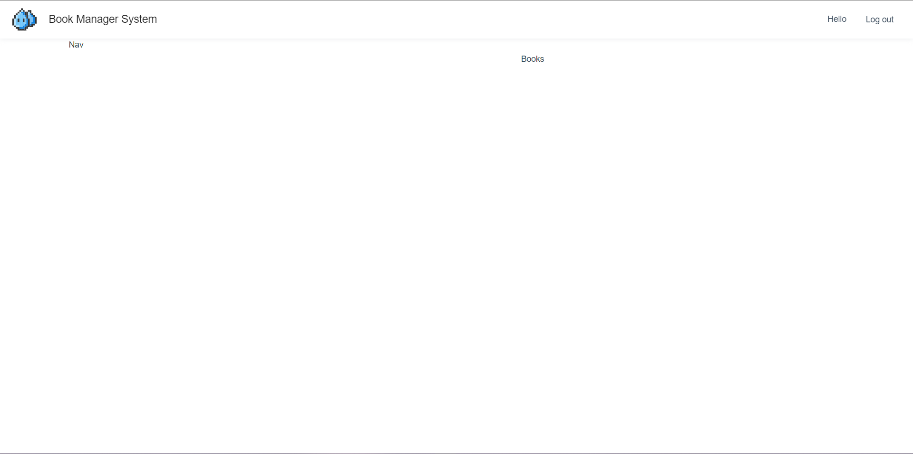

# MainList

## Basic front-end layout

```
│  │  ├─ layout
│  │  │  └─ BasicLayout
│  │  │     ├─ index.js
│  │  │     ├─ index.scss
│  │  │     ├─ index.vue
│  │  │     └─ Nav
│  │  │        ├─ index.js
│  │  │        ├─ index.scss
│  │  │        └─ index.vue

│  │  └─ views
│  │     ├─ Auth
│  │     │  ├─ index.js
│  │     │  ├─ index.scss
│  │     │  └─ index.vue
│  │     └─ Books
│  │        ├─ index.js
│  │        ├─ index.scss
│  │        └─ index.vue
```

### Define BasicLayout component

Create a new component for the main list page called BasicLayout.

```vue
<template>
  <div class="basic-layout">
    <div class="app-header">
      <div class="left">
        
        <div class="title">Book Manager System</div>
      </div>
      <div class="right">
        <div class="hello-msg">Hello</div>
        <div class="logout">Log out</div>
      </div>
    </div>
    <div class="app-header-placeholder"></div>
    <div class="app-content">
      <div class="left">
        <app-nav />
      </div>
      <div class="right">
        <router-view />
      </div>
    </div>
  </div>
</template>

<script src="./index.js"></script>

<style lang="scss" scoped>
@import './index.scss';
</style>

```

Create a children component Nav for BasicLayout for navigation.

Import Nav and register it as a vue-component in .vue. 

AppNav will be tagged as ''app-nav" in .vue.

```vue
export default defineComponent({
  components: {
    AppNav: Nav, // rename it to AppNav to prevent conflict with vue's 'Nav'
  },
})
```

Adjust layouts css.

```scss
.basic-layout {
  // hold the place for nav
  .app-header-placeholder {
    height: 64px;
    width: 100%;
  }
  .app-header {
    height: 64px;
    position: fixed;
    top: 0;
    left: 0;
    background-color: #fff;
    box-shadow: 0 2px 8px #f0f1f2;
    display: flex;
    align-items: center;
    justify-content: space-between;
    padding: 0 16px;
    width: 100%;
    z-index: 1;

    .left {
      display: flex;
      align-items: center;

      img {
        height: 50px;
        margin-right: 16px;
      }

      .title {
        color: rgba(0, 0, 0, 0.87);
        font-size: 18px;
      }
    }

    .right {
      display: flex;
      align-items: center;

      .logout {
        width: 80px;
        text-align: center;
        height: 64px;
        line-height: 64px;
        cursor: pointer;
        margin-left: 16px;

        &:hover {
          background-color: #eee;
        }
      }
    }
  }

  .app-content {
    display: flex;

    .left {
      width: 256px;
      position: fixed;
      background-color: white;
      top: 64px;
      bottom: 0;
    }

    .right {
      flex: 1;
      padding: 24px;
      margin-left: 256px;
    }
  }
}

```

 

### Add children router books

app-content.right should be dynamic, different content will be shown here, so add a router-view in ./BasicLayout/index.js

```vue
      <div class="right">
        <router-view />
      </div>
```

Register it as ./ 's children in ./router.

```js
  {
    path: '/',
    name: 'BasicLayout',
    component: () =>
      import(
        /* webpackChunkName: "BasicLayout" */ '../layout/BasicLayout/index.vue'
      ),
    // children router will be renderen inside its parent
    children: [
      {
        path: '/books',
        name: 'Books',
        component: () =>
          import(/* webpackChunkName: "Book" */ '../views/Books/index.vue'),
      },
    ],
  },
```

localhost:8080/books will be displayed in <router-view> in BasicLayout

Create book page in ./views/Books

```
│  │  └─ views
│  │     ├─ Auth
│  │     │  ├─ index.js
│  │     │  ├─ index.scss
│  │     │  └─ index.vue
│  │     └─ Books
│  │        ├─ index.js
│  │        ├─ index.scss
│  │        └─ index.vue
```

It looks like this:




## Book front-end


'scoped' is to state that all scoped css will only be effective within this component. Otherwise the css will be used globally.


### Create a new global component 

Add new self-define component under ./component/Spacebetween

```vue
<template>
  <div class="space-between">
    <slot />
  </div>
</template>

<style lang="scss" scoped>
.space-between {
  display: flex;
  justify-content: space-between;
}
</style>

<script src="./index.js"></script>
```

Register it a global component in ./main.js

```js

import { SpaceBetween } from '@/components/SpaceBetween'

createApp(App)
  .use(store)
  .use(Antd)
  .component('space-between', SpaceBetween)
  .use(router)
  .mount('#app')
```

Contents inside <space-between> will be put into <slot />
