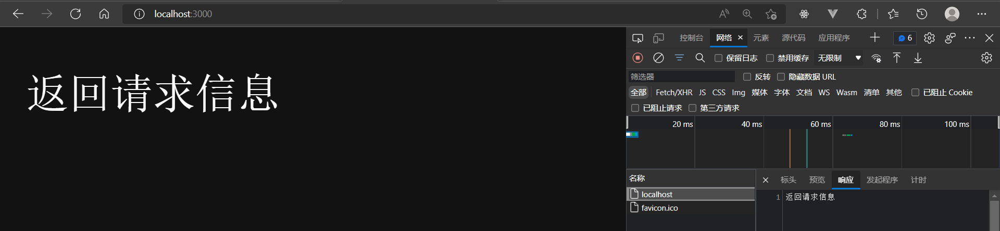
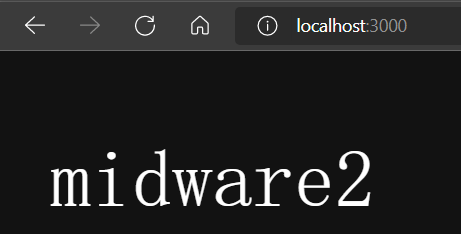
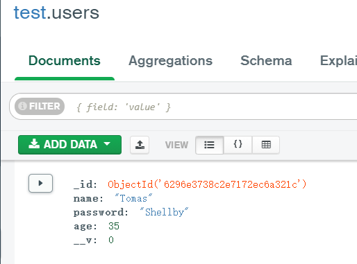
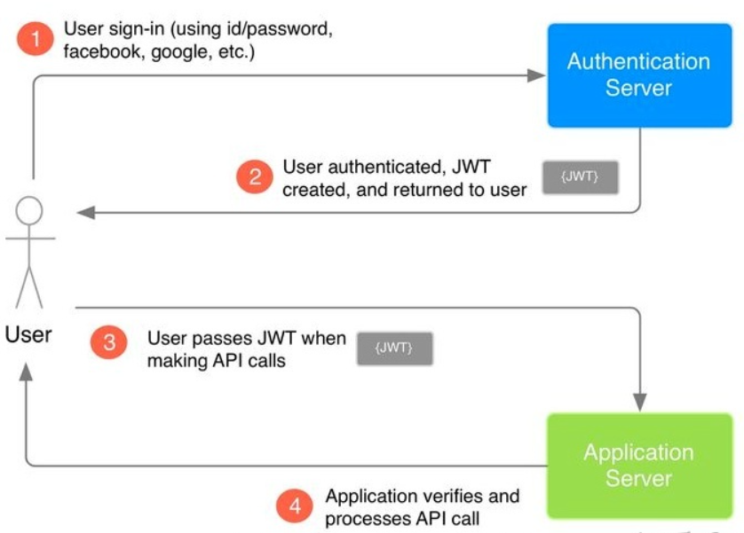

## Preparation

### use vue-cli to initialize the fe-program

vue-cli: a scaffold help to build program

```
vue create book-mgr-fe
```

### initialize the node be-program

```
npm init
```


## Be-dev & Dependencies Usage

### Koa

Koa is used for processing requests

```js
// import koa
const Koa = require('koa')

// koa instance: app
const app = new Koa()

// app.use：regist midware(a cb function), call this cb function every time a request is recieved
// ctx: request info
app.use((ctx) => {
    console.log(ctx.URL)	// output request's URL
    ctx.body = 'return request info'		//response info
})

// app.listen: listen to port 3000 and post a http request, and response after processing
// default URL: localhost
app.listen(3000, ()=>{
	console.log('Call this cb function when the be-service is launched')
})

```

return request info：




### promise

promise is an obj used in async fn.

promise got 3 states: 

* pending: initial state
* fulfilled: operation success
* rejected: operation failed

There are only 2 final states: rejected/resolved. Promise's state won't change when it is settled.

```js
let promise_obj = new Promise (function (resolve_val， reject_val)) {
    // ... some code 
    if(resolve_val){
        resolve(value)
    } 
	if(reject_val){
        reject(error)
    }
}
```


### async&await

async: state a async funciton. 

await: wait for a promise obj to be done.

await can only be used in async fn.

```js
function asyncFn () {
  return new Promise(function (resolve, reject) {
    setTimeout(function () {
      // chooose state  
      if (resolve) {
        console.log('resolve console')
        resolve('resolve return')
      } 
      if (reject) {
        reject('reject return')
      }
    }, 2000)
  })
}

// When await is followd by a promise obj
// await will block the process before promise's state become fulfilled/rejected
// await will return resolve's value to value1 if promise was resolved
var value1 = await asyncFn()	// await is followed by a promise obj
var value2 = await 'value2'		// await is followed by a String: value2 = String
console.log(value1)
console.log(value2)

// terminal output: 'resolve console' 'resolve return' 'value2'
// value1: 'resolve return'
```

When there are more than one mid-ware in one module, koa will register those mid-ware by code orders.  Therefore async can be of great use in dealing with koa's apps.

```js
const Koa = require('koa')

const app = new Koa()

// 1th midware
app.use(async (ctx, next) => {
  console.log('midware1')
  ctx.body = 'midware1'
  await next()	// process next midware
})

// 2nd midware
app.use(async (ctx) => {
  console.log('midware2')
  ctx.body = 'midware2'
})

app.listen(3000, () => {
  console.log('launched successfully')
})

// output: 'launched successfully' 'midware1' 'midware2'
```




### mongoose

Mongoose is used for operating mongoDB

connection:

```js
// import mongoose
const mongoose = require('mongoose')

// define function for connecting DB
const connect = () => {
  // mongoose methods，local DB port: 27017
  mongoose.connect('mongodb://127.0.0.1:27017')

  // listen for the event "open DB"
  mongoose.connection.on('open', () => {
    console.log('connected successfully')
  })
}

connect()
```

define schema & modal:

```js
// schema: a set of data 
const UserSchema = new mongoose.Schema({
  name: String,
  password: String,
  age: Number,
})

// modal: a set of methods on its relavant shema 
```

create modal instance

```js
  // connect{}
  // create a UserModal instance
  const user = new UserModal({
    name: 'Tomas',
    password: 'Shellby',
    age: '35',
  })

  // save the info into user & sycronize the info
  user.save()
```

data are stored in db test in default




### module programming

Every package in **node.js** is a module. If a.js wants to use the method in b.js, b.js has to expose the method as a module first, and a.js import that module.

```js
// b.js
const method_1 = () => {
    // method_1
}

const method_2 = () => {
    // method_2
}

// expose b.js methods as module
module.exports = {
    method_1,
    method_2,
}
```

When a file is **required**, that file will be **executed**.

So be sure to adjust the right require sequence when coding.

```js
// a.js
// import module
const method_1 = require('./b.js')
const method_2 = require('./b.js')
```

For the front-end, vue use 'import' and 'export'

```js
import axios from 'axios'

// make a post to back-end
export const register = (account, password) => {
  axios.post('http://localhost:3000/auth/register', {
    account,
    password,
  })
}
```


### Json Web Token

JWT is used for verifying users. HTTP is a stateless protocol, thus the browser won't be able to recognize if next post is from this logged in user.

JWT use token to solve this problem. 



In this case, browser only have to check JWT toke to deal with every post after login.

Sign token:

```js
let jwt = require('jsonwebtoken')
let token = jwt.sign(payload, signature)
```

Token has 3 parts:

* head: encyption algorithm.
* payload: info to be protected. exp: password.
* signature: secrete code used for decycption.

Decryption:

```js
jwt.verify(token, signature, (err, payload)=>{
    // only when signature is matched will the verification pass
    // payload will be sent if succeeded
})
```


## Fe-dev & Dependencies Usage

### vue-cli catalogue

```shell
├─ book-mgr-fe		
│  ├─ .browserslistrc	# choose the permitted browser
│  ├─ .eslintrc.js
│  ├─ babel.config.js
│  ├─ jsconfig.json
│  ├─ lint-staged.config.js
│  ├─ package-lock.json
│  ├─ package.json
│  ├─ public
│  │  ├─ favicon.ico
│  │  └─ index.html
│  ├─ README.md
│  ├─ src
│  │  ├─ App.vue		# entrance file
│  │  ├─ assets			# static resourses （css,less...)
│  │  │  └─ logo.png
│  │  ├─ components		# public components
│  │  │  └─ HelloWorld.vue
│  │  ├─ main.js		# root component
│  │  ├─ router			# deploy project router
│  │  │  └─ index.js
│  │  ├─ store			# 
│  │  │  └─ index.js
│  │  └─ views			# pages
│  │     ├─ AboutView.vue
│  │     └─ HomeView.vue
│  └─ vue.config.js
```


## Build and git

### Push projects to github

Init a repository in the local folder

```bash
git init
```

Add origin address into remote

```bash
git remote add origin https://github.com/jbddqdddqdgwdddd/BookManager.git
```

Edit .gitignore

```bash
book-mgr-be/node_modules
book-mgr-fe/node_modules
dev-usage.md
Login&Register.md
dev-usage.assets
Login&Register.assets
```

Add new branch

```bash
git branch develop
```

Change to another branch

```bash
git checkout branchname
```

**After initialization**

Add code to remote

```bash
git add .
git commit -m 'Code content'
```

Push code to repository ( branch: develop )

```bash
git push origin develop
```

**Other methodologies**

Amend the last commit:

1. Amend commit msg in the local repo:

```
git commit --amend
```

2. Push the msg to github mandatorily

```
git push origin develop --force
```

Delete branch

```
git branch -d (branchname)
```

Remote

```bash
git remote -v 			# check origin URL
git remote set-url origin newURL	# change origin		
```

